# VS Code for the Web - Azure

VS Code for the Web is a zero-install and browser-based version of Visual Studio Code. The `/azure` (for short) environment, accessible via <https://insiders.vscode.dev/azure>, is a dedicated space for Azure development, allowing you to run, debug, and deploy applications to Azure in seconds.

Powered by [Azure Cloud Shell](https://learn.microsoft.com/en-us/azure/cloud-shell/overview), this environment offers up to **4 hours of compute time**, eliminating the need to manually configure dev environments or install dependencies. `/azure` comes preloaded with the latest libraries, extensions, and tools to get you coding instantly.

<iframe width="560" height="315" src="https://www.youtube-nocookie.com/embed/qmJigVn8gcg?si=1NTRy3uSohVrqY1e" title="Announcing VS Code for the Web" frameborder="0" allow="accelerometer; autoplay; clipboard-write; encrypted-media; gyroscope; picture-in-picture" allowfullscreen></iframe>

## Getting started

The `/azure` environment includes everything you need to start developing and deploying Azure applications:

### Pre-installed extensions

[Azure Developer CLI](https://marketplace.visualstudio.com/items?itemName=ms-azuretools.azure-dev) - This extension makes it easier to run, create Azure Resources, and deploy Azure applications with the Azure Developer CLI.

### Supported Programming Languages

All major runtimes are pre-installed:
* Python - 3.12.9
* Java - openjdk 17.0.14 2025-01-21 LTS
    * OpenJDK Runtime Environment Microsoft-10800290 (build 17.0.14+7-LTS)
    * OpenJDK 64-Bit Server VM Microsoft-10800290 (build 17.0.14+7-LTS, mixed mode, sharing)
* Node.js - v20.14.0
* C# - 9.0.0

### GitHub repositories

Seamlessly commit your changes directly to your GitHub repository using the [GitHub Repository extension](https://marketplace.visualstudio.com/items?itemName=GitHub.remotehub). GitHub Repositories allows you to remotely browse and edit a repository from within the editor, without needing to pull code onto your local machine. You can learn more about the extension and how it works in our [GitHub Repositories guide](https://code.visualstudio.com/docs/sourcecontrol/github#_github-repositories-extension).

### Continue working in VS Code on the desktop

After the Azure Cloud Shell container time is up, you may want to continue your work in VS Code on the desktop. Use the **Continue Working on** button, located in the Status Bar of VS Code for the Web, to commit your code to a chosen repository in GitHub, and move over to your local environment.

Within this experience, you have two options for local continuation:
* **Using Docker**: Launch a pre-configured development container.
* **Using VS Code Locally**: Clone the repo and configure your environment using a README.

## Azure entry points

The `/azure` experience integrates with Azure AI Foundry to bring code closer to developers. Buttons like **Open in VS Code for the Web** are available directly within environments like the **Chat Playground** and **Agent Playground**. See more in the sample use cases or scenarios section.

To get started:
1. Choose a model.
2. Build and test your agent.
3. Select **View Code**, and then select your programming language and SDK.
4. Launch directly into VS Code using the **Open in VS Code** button for the Web with **one click**.

Additionally, developers can get started with templates using the AI App Gallery(https://aka.ms/aiapps) and select **Open in VS Code** to launch their template in one operation to the `/azure` environment.

To get started:
1. Navigate to the AI App Gallery(https://aka.ms/aiapps)
2. Choose a template or search for a template you'd like to run
3. Select **Open in VS Code** from the dropdown menu
4. Launch directly into VS Code and use GitHub Copilot to answer any questions you might have.

## 🧪 Sample use cases or scenarios

The following are commonly used scenarios for the `\azure` environment.

* [Using Azure AI Foundry to create a model deployment and open your code in VS Code]((https://ai.azure.com))

1. From the Azure AI Foundry portal, select the best model for your use case, including o3, o4-mini or MAI-DS-R1 from Foundry Models. In this case, we’ll use gpt-4o-mini as an example model for an agent workflow.

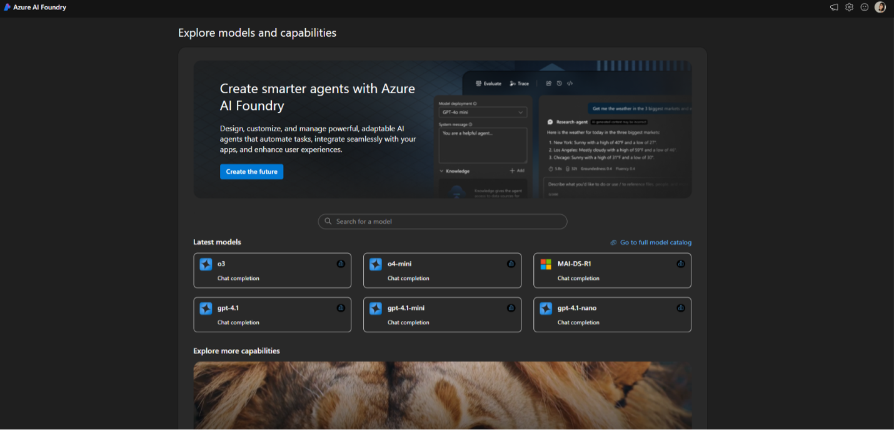

2. Provision the model endpoint from the gpt-4o-mini model card.

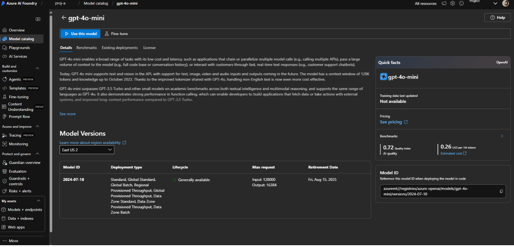

3. Arrive in the agents playground, alter generation controls like max responses and past messages. Add knowledge, tools, and actions.

4. Iterate on your sample prompt and continue experimentation in the agents playground.

5. Once happy, click the View Code button to see the contextual code sample for your interaction with the agent in the agents playground.

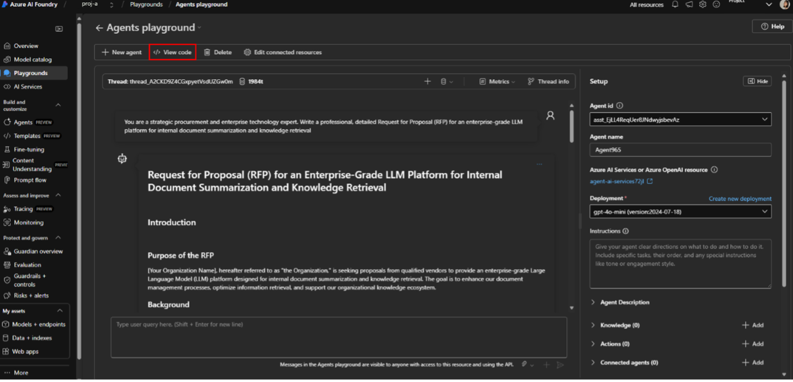

There, you can see multi-lingual code samples in Python, C#, and JavaScript for agents and with the inclusion of JSON, cURL, JavaScript, C#, and Go for models Entra ID can be used to authenticate agents with "Key Authorization" now available for models.

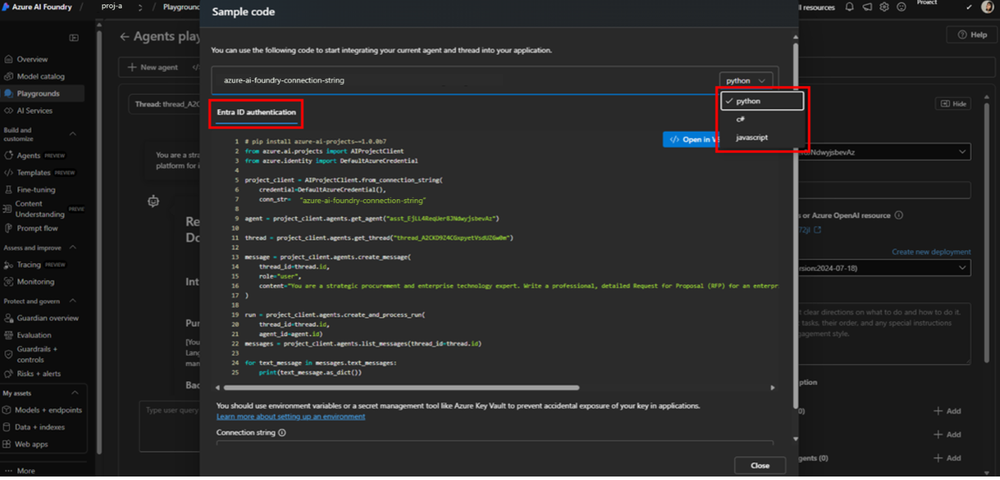

6. When ready, click Open in VS Code and be redirected to the /azure environment of VS Code for Web.

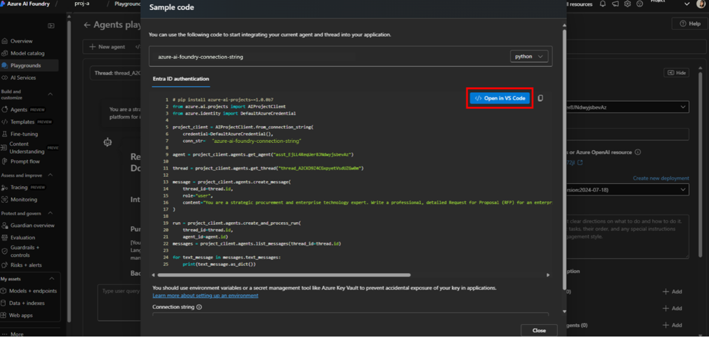

You’ll notice that as the environment is set-up, the code sample, API endpoint, and key are automatically imported into a new VS Code for Web workspace.

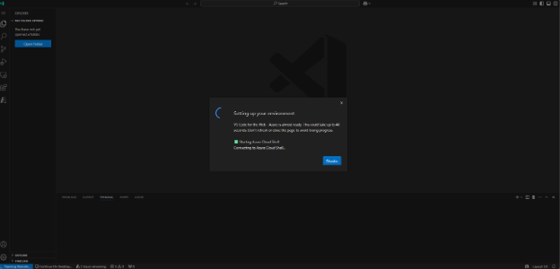

In the bottom right corner, you’ll see that the API key is set in the terminal’s environment variables and that the sample code has been downloaded successfully.

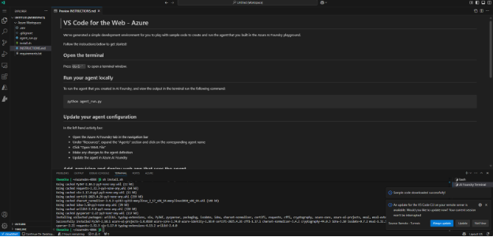

7. Run the model locally via the terminal through `python agent_run.py`. Within seconds, you’ll see a successful model response.

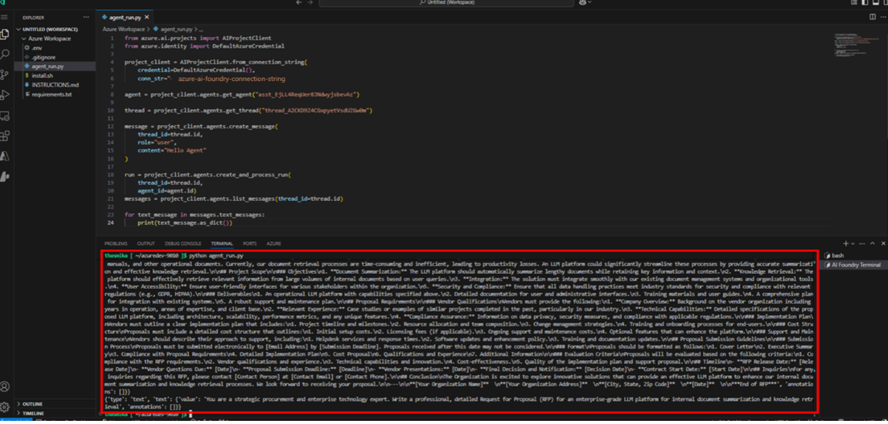

8. `azd` commands can be used to provision and deploy a web app using the agent. `azd init` initializes the git repo which creates a default Azure workspace where the agent can be used in an application.

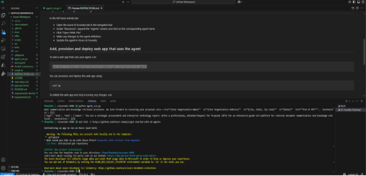

9. `azd up` provisions the web app in creating the relevant Azure resources. Once done, you can see your application running in the browser by clicking the link provided in the terminal

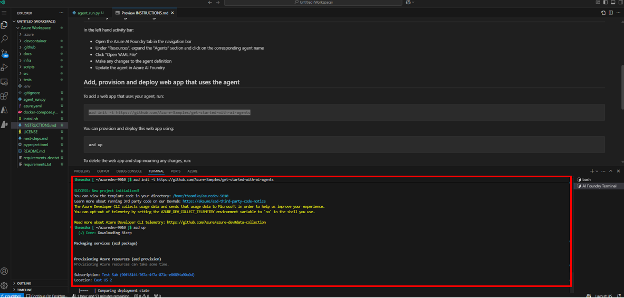

10. Continue in VS Code Desktop or GitHub Desktop by clicking on “Continue on Desktop” in the bottom left corner. This button allows you to move your workspace to your local environment with one-click. If you have a dev container attached to an existing application, you have the choice to move using that container or to move local.

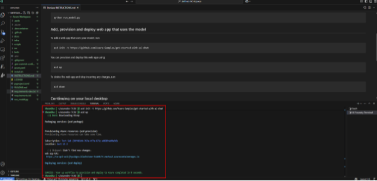

* [Spinning up a quick Azure Function app](https://learn.microsoft.com/en-us/azure/azure-functions/functions-develop-vs-code?tabs=node-v4%2Cpython-v2%2Cisolated-process%2Cquick-create&pivots=programming-language-python)

The above quick start is applicable to vscode.dev/azure since vscode.dev/azure covers all of the prerequisites:
- Python installed
- Azure Functions Core Tools installed
- Users will need to install these themselves:
- Azure Functions extension

* [Building and testing an AI agent using the Azure AI Toolkit](https://code.visualstudio.com/docs/intelligentapps/overview)

Key features:
- Model catalog with rich generative AI models sources (GitHub, ONNX, OpenAI, Anthropic, Google, ...)
- Bring Your Own Models from remotely hosted model, or Ollama models that are running locally
- Playground for model inference or testing via chat
- Attachment support for multi-modal language models
- Batch run prompts for selected AI models
- Evaluate an AI model with a dataset for supported popular evaluators like F1 score, relevance, similarity, coherence, and more

* [Rapid prototyping with VS Code extensions and Python](https://code.visualstudio.com/docs/python/python-quick-start)

## 🔧 Limitations

Although VS Code for the Web is almost at parity with VS Code Desktop, there are some limitations to the development environment:

* No terminal access beyond Cloud Shell
* Limited support for some native extensions or language features
* No offline support

## 🛠️ Troubleshooting

If you encounter any issues with VS Code for the Web – Azure, please log an issue at in our [GitHub repository](https://github.com/microsoft/vscode-dev-azure)

### Account type prompt issue
If you see a prompt asking "What type of account did you use to start this tunnel?" then it's likely that you're on vscode.dev/azure and not insiders.vscode.dev/azure. Currently this product is only available on Insiders. To fix this, navigate to <https://insiders.vscode.dev/azure>.

### Connection issue
If you're unable to connect to insiders.vscode.dev/azure, you can usually fix it by resetting your Azure Cloud Shell. This can be done from the Azure Portal.

Open Cloud Shell in the Azure Portal using the button in the top right corner.

Next, in the Settings dropdown, select **Reset User Settings**.

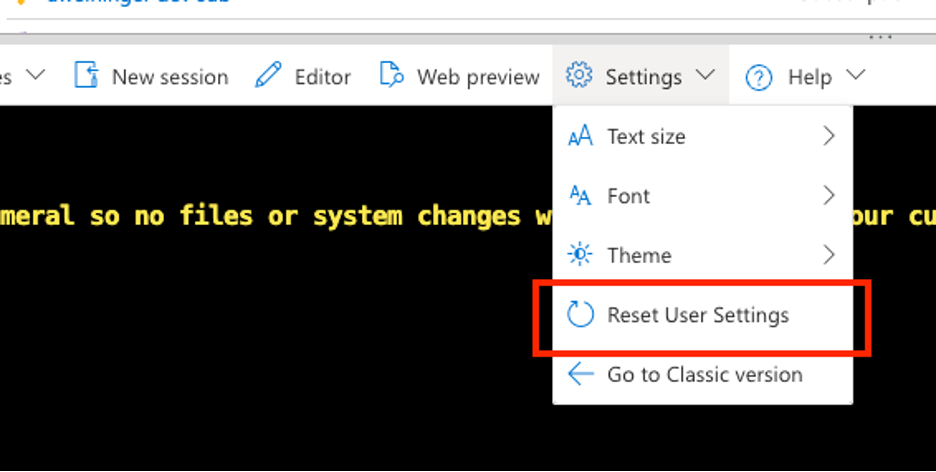

Once finished you should see this screen.

### Gathering logs
The extension logs will help us diagnose any issues with vscode.dev/azure. You can access them by going to the Output view, then selecting the **VS Code for the Web - Azure** output channel.

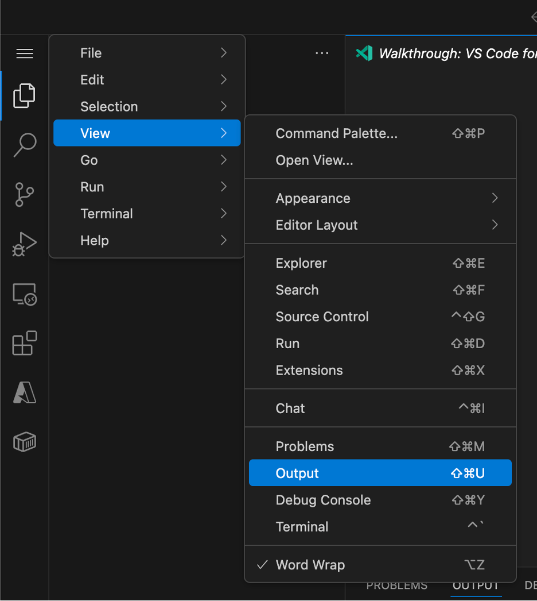

## 🚀 Next steps / related resources

Keep learning and exploring with the following resources:

* [Azure Developer CLI documentation](https://learn.microsoft.com/en-us/azure/developer/azure-developer-cli/)
* [GitHub Copilot](https://github.com/features/copilot)
* [Azure AI Studio](https://ai.azure.com/)
* [VS Code Dev Containers](https://containers.dev/)

🤝 Feedback and Support

Create issues in our [GitHub repository](https://github.com/microsoft/vscode-dev-azure) as you find them while using vscode.dev/azure. The more detail the better. If possible, include logs from the "VS Code for the Web - Azure" output channel.
